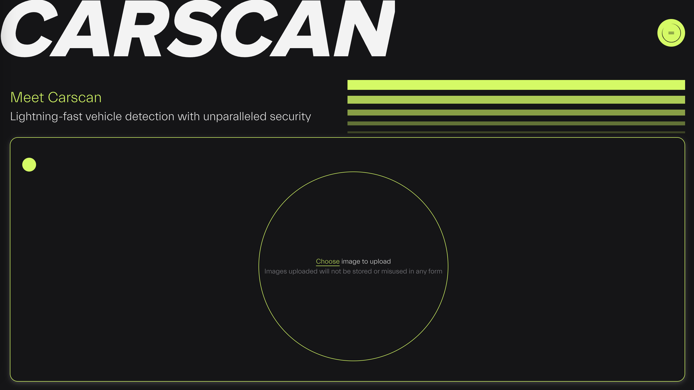

# CARSCAN

CarScan is a web-based application that allows users to upload an image containing traffic scenes and performs vehicle detection to determine the number of vehicles present in the image.

## Features

- Upload images containing traffic scenes and process them to detect vehicles.

## Usage

- Clone the repository and cd into app directory
```
git clone https://github.com/Anirudh-R-2506/CarScan.git && cd CarScan
```

- Install requirements
```
npm install
pip install -r server/requirements.txt
```

- Download the .weights file for the model from the below URL and put it in the server/dnn_model directory
```
https://drive.google.com/file/d/1xEJ0L_6fUxRzjUolbhPGls7fkoEGVQ_X/view?usp=sharing
```

- Run the following commands in seperate terminal windows
```
python3 server/app.py
```
```
npm run dev
```
- Visit the URL from the `npm run dev` command to use the application

## Demo

[](example/recording.mov)
